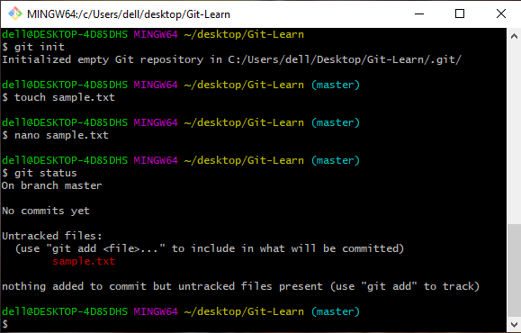
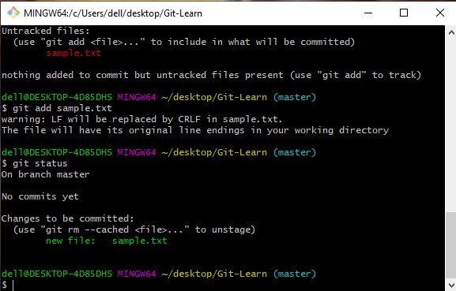

# Tutorial
## Installing and Getting Started
- Install Git 

- After Installing Git set your identity
```
git config --global user.name  "Twinkle Sharma"
git config --global user.email "smtwinkle451@gmail.com"
```
- View Identity at any time
```
git config --global user.name  
git config --global user.email
```


- Initializing Git Repository
```
git init
```
```git init``` turns any directory into a Git repository, it is used to initialize git repository, Git creates a hidden directory called .git. 
That directory stores all of the objects and refs that Git uses and creates as a part of project's history. 
This hidden .git directory is what separates a regular directory from a Git repository.
use ```ls -lart``` to verify this .git folder has been created.


## Different Areas in Git.
1. Untracked
2. Staging
3. Commited

The Working Tree is the area where you are currently working. It is where your files live. This area is also known as the “untracked” area of git. Any changes to files will be marked and seen in the Working Tree. Here if you make changes and do not explicitly save them to git, you will lose the changes made to your files. This loss of changes occurs because git is not aware of the files or changes in the Working Tree until you tell it to pay attention to them. 

The Staging Area is when git starts tracking and saving changes that occur in files. These saved changes reflect in the .git directory. You tell git that I want to track these specific files, then git moves them from Working Tree to the Staging Area.
<hr>

<hr>

<hr>

<hr>

- Checking Git Status
```
git status
```
```git status``` shows the files in your Working Tree and the files in your Staging Area, what branch you're on and any other important information.
<hr>

<hr>

- Adding File to Staging Area
```
git add
```
```git add``` command adds new or changed files in your working directory to the Git staging area, git add is an important command - without it, no git commit would ever do anything. 
```git add [filename]``` selects that file, and moves it to the staging area, marking it for inclusion in the next commit. You can select all files, a directory, specific files, or even specific parts of a file for staging and commit.
<hr>

<hr>

- Commiting Files from Staging Area
```
git commit
```
```git commit``` takes snapshot of current version/or current staged condition.

<hr>

<hr>


